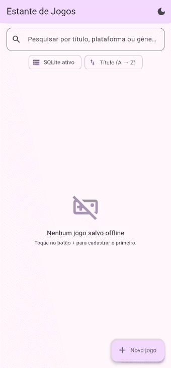

# 🎮 Estante de Jogos (Offline)

Aplicativo Flutter que demonstra, na prática, **Persistência de Dados Local** combinando duas tecnologias:

| Tecnologia | Para quê usamos | Pacote |
|---|---|---|
| **SQLite** | Dados estruturados: o CRUD de jogos (tabela relacional) | [`sqflite`](https://pub.dev/packages/sqflite) + [`path`](https://pub.dev/packages/path) |
| **SharedPreferences** | Configurações chave-valor: o **tema** (claro/escuro) e a **ordenação da lista** | [`shared_preferences`](https://pub.dev/packages/shared_preferences) |
| **SQLite (WebAssembly)** | O mesmo banco, quando o app roda no navegador | [`sqflite_common_ffi_web`](https://pub.dev/packages/sqflite_common_ffi_web) |

O usuário pode **cadastrar, listar, pesquisar, editar e remover** os jogos da sua estante — tudo salvo **offline** no dispositivo.

> Adaptação do projeto base [`ADSSTech/persistence_app`](https://github.com/ADSSTech/persistence_app) (Portal Cidadão / políticos) para o tema **jogos**, conforme a [issue #2](https://github.com/ADSSTech/persistence_app/issues/2).

---

## 🎬 Demonstração

<p align="center">
  
</p>

O GIF percorre o app inteiro: estado vazio → cadastro de 3 jogos → pesquisa por
gênero → troca da ordenação (para *Nota, maior primeiro*) → edição de uma nota →
tema escuro → remoção com confirmação → e a **reabertura do app**, que volta
escuro, ordenado por nota e com os jogos que ficaram no banco.

> **Como ele foi gerado:** não é uma gravação manual de tela. Cada quadro é um
> print tirado pelo teste de integração `integration_test/demo_test.dart`, que
> dirige o app **de verdade** — com SQLite e SharedPreferences reais. A captura
> rodou no **Chrome**, onde o banco é o mesmo SQLite compilado para WebAssembly
> (veja *Rodando no navegador*, abaixo). O mesmo teste roda em um emulador ou
> celular Android com um único comando, sem alterar nada no app.

---

## 📱 O que o app faz

1. **Lista** os jogos salvos no banco local (título, plataforma, gênero e nota).
2. **Cadastra** um novo jogo por um formulário (BottomSheet) com validação.
3. **Pesquisa** por título, plataforma ou gênero (filtro em tempo real).
4. **Edita** um jogo (toque no lápis ou no card) — mesmo formulário, pré-preenchido.
5. **Remove** um jogo (com diálogo de confirmação).
6. **Alterna o tema** claro/escuro pela AppBar — e **lembra a escolha** na próxima abertura.
7. ⭐ **Ordena a lista** por título (A→Z / Z→A), nota ou plataforma — e **lembra a escolha** na próxima abertura.
8. Mostra um **indicador "SQLite ativo"** e **SnackBars** de feedback ao salvar/editar/remover/reordenar.

> O app cobre o **CRUD completo**: Create (cadastrar), Read (listar/pesquisar), Update (editar) e Delete (remover).

### O card de cada jogo

| Elemento | Conteúdo |
|---|---|
| Avatar | Sigla da plataforma (`PC`, `PS5`, `SWI`, `XSX`…) |
| Título | Nome do jogo |
| Subtítulo | `gênero • plataforma` |
| Selo | Nota de 0 a 10, colorida por faixa (🟢 ≥8, 🟠 ≥5, 🔴 <5) |
| Ações | ✏️ editar e 🗑️ remover |

### Estados da tela (via `FutureBuilder`)

| Estado | O que aparece |
|---|---|
| ⏳ Carregando | `CircularProgressIndicator()` |
| 🎮 Vazio | Ícone amigável + "Nenhum jogo salvo offline" |
| 📋 Com dados | `ListView` de `Card`s com avatar da plataforma, selo de nota e botões |
| ⚠️ Erro | Mensagem de erro amigável |

---

## ⭐ As duas preferências persistidas (SharedPreferences)

O projeto base já salvava o tema. Esta versão adiciona uma **segunda** preferência: a **ordenação da lista**.

| Preferência | Chave | Valores | Classe |
|---|---|---|---|
| Tema claro/escuro | `is_dark_mode` | `bool` | `data/theme_preferences.dart` |
| **Ordenação da lista** ⭐ | `ordem_lista_jogos` | `titulo_asc`, `titulo_desc`, `nota_desc`, `plataforma_asc` | `data/ordenacao_preferences.dart` |

### Como a ordenação funciona

1. O usuário escolhe uma opção no menu ⇅ da tela.
2. A `HomePage` grava a escolha no SharedPreferences (`OrdenacaoPreferences.saveOrdem`).
3. A lista é **relida do banco** com o novo `ORDER BY` — quem ordena é o **SQLite**, não a tela.
4. Ao reabrir o app, o `main()` lê a preferência **antes do primeiro frame** e o app já abre na ordem escolhida.

```dart
// lib/data/ordenacao_preferences.dart
Future<OrdemJogos> loadOrdem() async {
  final prefs = await SharedPreferences.getInstance();
  return OrdemJogos.fromId(prefs.getString(_kOrdemLista));
}
```

Duas decisões que valem explicar:

- **Gravamos o `id` (String) do enum, não o `index` (int).** Se um dia as opções do enum forem reordenadas, a preferência já salva no aparelho do usuário continuaria válida — com o `index` ela passaria a apontar para outra opção.
- **O `ORDER BY` vem do enum, nunca do usuário.** O fragmento SQL é uma constante do código (`OrdemJogos.orderBy`), então não há risco de SQL Injection. Os valores que o usuário digita (busca, campos do formulário) continuam indo por `whereArgs`/parâmetros.

---

## 🧱 Arquitetura (em camadas)

O código **não** fica todo em um arquivo. Cada responsabilidade tem seu lugar — como em um projeto profissional:

```
lib/
├── main.dart                        # Bootstrap: carrega tema + ordenação e sobe o app
├── app.dart                         # MaterialApp + gestão do tema (claro/escuro)
│
├── models/
│   ├── jogo_model.dart              # Entidade IMUTÁVEL. toMap() / fromMap()
│   └── ordem_jogos.dart             # Enum das opções de ordenação (id + label + SQL)
│
├── data/                            # Camada de dados (persistência)
│   ├── database_helper.dart         # Singleton do SQLite (abre banco + cria schema)
│   ├── db_platform.dart             # Escolhe o SQLite nativo (Android/iOS) ou o WebAssembly
│   ├── db_platform_io.dart          #   └─ Android/iOS: nada a fazer
│   ├── db_platform_web.dart         #   └─ navegador: SQLite WebAssembly + IndexedDB
│   ├── i_jogo_repository.dart       # Contrato (interface) do repositório
│   ├── jogo_repository.dart         # CRUD (isola o SQL da UI)
│   ├── theme_preferences.dart       # Wrapper do SharedPreferences (tema)
│   └── ordenacao_preferences.dart   # Wrapper do SharedPreferences (ordenação) ⭐
│
└── ui/                              # Camada de apresentação
    ├── home_page.dart               # Tela principal (FutureBuilder + busca + menu de ordem)
    └── widgets/
        ├── jogo_card.dart           # Card/ListTile de um jogo (+ selo da nota)
        ├── jogo_form.dart           # Formulário (BottomSheet) com validação
        └── empty_state.dart         # Estado vazio amigável
```

### Por que separar assim?

- **`DatabaseHelper` (Singleton):** garante **uma única conexão** com o arquivo do banco. Abrir o mesmo banco várias vezes em paralelo pode **corromper** o arquivo — o Singleton evita isso.
- **`JogoRepository`:** a tela **não sabe** que existe SQL. Ela pede "insere", "lista", "remove". Isso permite **testar a UI** com um repositório fake e trocar a fonte de dados sem mexer na interface.
- **`JogoModel` imutável:** `toMap()` grava no banco; `fromMap()` reconstrói o objeto ao ler. É a ponte objeto ⇄ linha da tabela.
- **`OrdemJogos` (enum enriquecido):** reúne num só lugar as três faces de cada opção — a chave persistida, o texto do menu e o `ORDER BY` do SQL. Não importa Flutter: é domínio puro, usado pelas duas camadas.

### Esquema da tabela `jogos`

```sql
CREATE TABLE jogos (
  id         INTEGER PRIMARY KEY AUTOINCREMENT,
  titulo     TEXT NOT NULL,
  plataforma TEXT NOT NULL,
  genero     TEXT NOT NULL,
  nota       INTEGER NOT NULL CHECK (nota BETWEEN 0 AND 10)
);
```

O banco fica em `estante_jogos.db`, no diretório padrão de bancos do dispositivo. O `CHECK` repete no banco a regra que o formulário já valida — defesa em profundidade.

---

## ▶️ Como rodar

### Pré-requisitos
- [Flutter 3.10+](https://docs.flutter.dev/get-started/install) instalado (`flutter doctor` sem erros).
- Um emulador Android, simulador iOS **ou** dispositivo físico conectado.

### Passos

```bash
# 1. Instale as dependências
flutter pub get

# 2. Veja os dispositivos disponíveis
flutter devices

# 3. Rode o app (Android/iOS é o alvo recomendado — o SQLite é nativo lá)
flutter run
```

Para escolher um dispositivo específico:

```bash
flutter run -d <id-do-dispositivo>   # ex.: flutter run -d emulator-5554
```

### Rodando no navegador

O `sqflite` é nativo em **Android** e **iOS** — lá não há nada a configurar. Para
o app também rodar no Chrome, `lib/data/db_platform.dart` troca, **em tempo de
compilação**, o banco nativo pelo `sqflite_common_ffi_web`: o mesmo SQLite,
compilado para WebAssembly, persistindo em IndexedDB. Nenhum `if` de plataforma
espalhado pelo código, e o build do Android não enxerga o código de web.

```bash
# Uma vez: copia sqlite3.wasm e sqflite_sw.js para web/
dart run sqflite_common_ffi_web:setup

flutter run -d chrome
```

Os dados no navegador também sobrevivem ao fechar e reabrir a aba.

---

## ✅ Como testar (sem precisar de celular)

O projeto acompanha testes automatizados que provam o funcionamento **sem device físico** (o SQLite roda em memória via `sqflite_common_ffi`):

```bash
flutter test
```

Saída esperada:

```
00:02 +18: All tests passed!
```

Os **18 testes** cobrem:

1. **CRUD real no SQLite** — insere → lista → atualiza → remove.
2. **`ORDER BY` de cada opção de ordenação** — as 4 ordens devolvem a sequência correta.
3. **Mapeamento do modelo** — `toMap`/`fromMap` simétricos, e `id` omitido enquanto é `null` (para o `AUTOINCREMENT` agir).
4. **Nova SharedPreference** — default na 1ª execução, gravação/releitura, e resiliência a um valor salvo inválido.
5. **UI** — estado vazio, lista com dados, filtro de busca, cadastro, validação da nota (0 a 10), edição e remoção com confirmação.
6. **Ordenação de ponta a ponta** — trocar no menu reordena a lista **e** grava a preferência; e o app **reabre** já na ordem que estava salva.

### Teste de integração (o app rodando de verdade)

Além dos 18 testes acima, `integration_test/demo_test.dart` sobe o app inteiro,
**sem repositório fake**: SQLite real e SharedPreferences real. Ele percorre o
roteiro completo (cadastrar → pesquisar → ordenar → editar → tema → remover →
reabrir) e tira um print em cada etapa — são esses prints que viram o GIF.

```bash
# No navegador (precisa do chromedriver na versão do seu Chrome):
chromedriver --port=4444
flutter drive --driver=test_driver/integration_test.dart               --target=integration_test/demo_test.dart               -d chrome --browser-name=chrome --browser-dimension=420x900@2

# Em um emulador ou celular Android conectado:
flutter drive --driver=test_driver/integration_test.dart               --target=integration_test/demo_test.dart
```

Os prints saem em `.demo_frames/` (fora do controle de versão).

Para checar o código estático (lint):

```bash
flutter analyze     # deve retornar: No issues found!
```

---

## 🧭 Roteiro de leitura sugerido (para estudo)

1. `models/jogo_model.dart` — como mapeamos objeto ⇄ linha da tabela.
2. `models/ordem_jogos.dart` — o enum que liga preferência, menu e SQL.
3. `data/database_helper.dart` — Singleton + abertura do banco + criação do schema.
4. `data/jogo_repository.dart` — as operações CRUD isoladas da UI (e o `ORDER BY`).
5. `data/theme_preferences.dart` e `data/ordenacao_preferences.dart` — as duas configurações no SharedPreferences.
6. `main.dart` + `app.dart` — carregamento das preferências salvas e montagem do app.
7. `ui/home_page.dart` — o `FutureBuilder` desenhando a lista e reagindo aos estados.

---

## 📦 Dependências principais

```yaml
dependencies:
  sqflite: ^2.3.3+1              # Banco relacional embarcado (SQLite)
  path: ^1.9.0                   # Monta o caminho do arquivo do banco por SO
  shared_preferences: ^2.2.3     # Armazenamento chave-valor (tema + ordenação)
  sqflite_common_ffi_web: ^1.2.0 # O mesmo SQLite, em WebAssembly, para o navegador

dev_dependencies:
  sqflite_common_ffi: ^2.4.0+3 # SQLite em memória para os testes (desktop/CI)
  integration_test:            # Testes com o app rodando de verdade
    sdk: flutter
```

---

## 🔄 O que mudou em relação ao projeto base

| Camada | Antes (Portal Cidadão) | Agora (Estante de Jogos) |
|---|---|---|
| Modelo | `PoliticoModel` (nome, partido, uf) | `JogoModel` (titulo, plataforma, genero, **nota**) |
| Banco | `portal_cidadao.db`, tabela `politicos` | `estante_jogos.db`, tabela `jogos` (+ `CHECK` na nota) |
| Repositório | `PoliticoRepository`, `getAll()` fixo em nome A→Z | `JogoRepository`, `getAll({ordem})` com `ORDER BY` variável |
| Preferências | 1 (tema) | **2** (tema + ⭐ ordenação da lista) |
| Widgets | `PoliticoCard`, `PoliticoForm` | `JogoCard` (+ selo de nota), `JogoForm` (4 campos) |
| Testes | 8 | **18** + 1 de integração (que gera o GIF) |
| Plataformas | Android/iOS | Android/iOS **e navegador** (SQLite WebAssembly) |

---

Projeto acadêmico — SENAI, Desenvolvimento Mobile.
